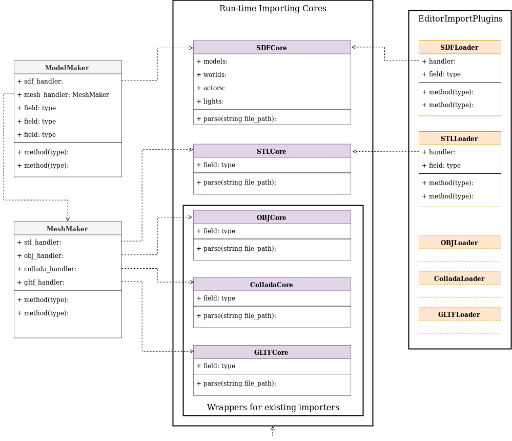

## ModelMaker

ModelMakers main feature is allowing the importing of URDF and SDF files
into Godot from either the editor or during runtime.

#### Features
* Expose built-in Collada (.dae), OBJ and GLTF file importing features to the runtime environment
* Adds STL importing to both the editor and runtime environments
* Adds URDF/SDF importing to both the editor and runtime

#### Architecture overview



#### Scripts
* ```copy_module_in.sh```
  * Copies the module directory from an outside location for seperate version controlling

* ```copy_module_out.sh```
  * Copies the module in from an outside location
 